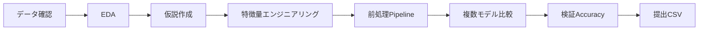

# Titanic生存予測: EDA・特徴量エンジニアリング・機械学習

Titanic乗客データを用いて、生存有無 `Survived` を予測するデータ分析・機械学習プロジェクトです。単にAccuracyを上げるだけではなく、データ確認、EDA、仮説構築、特徴量エンジニアリング、モデル比較、評価、提出用CSV作成までの一連の流れを整理しています。

## 開発背景・完成までの流れ

- まず `train_local`、`valid`、`eval` の行数・列数・欠損値・データ型を確認しました。
- EDAでは `Sex`、`Pclass`、`Age`、`Cabin`、`Name` などと生存率の関係を確認しました。
- EDAから得た仮説をもとに、家族人数、単独乗船、敬称、Cabin情報の有無、Deckなどの特徴量を作成しました。
- 欠損値補完、カテゴリ変数のOne-Hot Encoding、モデル学習を `Pipeline` と `ColumnTransformer` で一貫して処理しました。
- Logistic Regression、Random Forest、Gradient Boostingを比較し、検証データでAccuracyを評価しました。
- 最後に `eval` データに対する予測結果を `submission_eval.csv` として出力しました。

## ディレクトリ構成

```text
.
├── README.md
├── requirements.txt
├── data/
│   └── README.md
├── notebooks/
│   └── titanic_eda_feature_engineering_solution.ipynb
├── outputs/
│   ├── submission_eval.csv
│   └── titanic_experiment_results.csv
├── reports/
│   ├── form_answers_ja.md
│   ├── titanic_resume_ja.md
│   └── titanic_resume_vi.md
└── src/
    └── titanic_solution.py
```

## データセット

このプロジェクトでは以下のCSVを使用します。

- `train_local (1).csv`: `Survived` を含む学習データ
- `valid (1).csv`: `Survived` を含む検証データ
- `eval (1).csv`: 予測対象データ
- `sample_submission.csv`: 提出形式のサンプル

元データは授業・課題用のデータであるため、公開リポジトリには含めていません。ローカルで実行する場合は以下に配置します。

```text
data/raw/train_local (1).csv
data/raw/valid (1).csv
data/raw/eval (1).csv
data/raw/sample_submission.csv
```

開発時に使用した `Downloads` 配下のパスにも対応しています。

## 主なEDA結果

- `Sex`: 女性の生存率が男性より大きく高く、生存予測に強い影響があると考えました。
- `Pclass`: 1等客室の乗客は2等・3等より生存率が高い傾向がありました。
- `Age`: 欠損値はありますが、子ども・大人の違いを表す可能性があります。
- `Cabin`: 欠損が多いものの、Cabin情報の有無自体が社会的・位置的な情報を含む可能性があります。
- `Name`: `Mr`、`Mrs`、`Miss`、`Master` などの敬称から、性別・年齢・社会的立場の情報を抽出できると考えました。

## 特徴量エンジニアリング

作成した主な特徴量:

- `FamilySize = SibSp + Parch + 1`
- `IsAlone`
- `Title`: `Name` から敬称を抽出
- `HasCabin`
- `Deck`: `Cabin` の先頭文字から抽出

これらはランダムに追加した特徴量ではなく、EDAで確認した傾向をもとに設計しました。

## 使用技術

- Python
- pandas: CSV読み込み、データ確認、特徴量作成
- scikit-learn: Pipeline、ColumnTransformer、前処理、モデル学習、評価
- Logistic Regression / Random Forest / Gradient Boosting
- Jupyter Notebook: EDAと説明用資料
- Git / GitHub: バージョン管理・成果物提出

## アピールできるスキル

- データ品質確認と欠損値処理
- EDAから仮説を立て、特徴量へ変換する力
- 数値変数・カテゴリ変数を分けた前処理設計
- `Pipeline` による再現性の高い機械学習フロー構築
- 複数モデルの比較と検証データによる評価
- 分析結果をレポートとして説明する力

## モデル結果

`valid.csv` に対するAccuracy:

| 実験名 | Accuracy |
| --- | ---: |
| baseline_logreg | 0.805970 |
| baseline_rf | 0.820896 |
| feature_gb | 0.850746 |
| feature_logreg | 0.873134 |
| feature_rf | 0.873134 |

最良Accuracy:

```text
0.873134
```

特徴量を追加したモデルは、ベースラインよりも良い結果になりました。

## ビジネス分析としての価値

このプロジェクトは小規模なデータ分析ですが、実務の分析プロセスに近い形で構成しています。

- 目的変数に関係しそうな説明変数を見つける
- なぜその変数が重要かを説明する
- 仮説を特徴量として実装する
- ベースラインと改善モデルを比較する
- 意思決定に使える形で結果をまとめる

同じ流れは、解約予測、顧客セグメント分析、営業リードスコアリング、キャンペーン反応予測、リスク分析などにも応用できます。

## 実行方法

依存ライブラリをインストールします。

```bash
pip install -r requirements.txt
```

パイプラインを実行します。

```bash
python src/titanic_solution.py
```

出力ファイル:

```text
outputs/titanic_experiment_results.csv
outputs/submission_eval.csv
```

## 今後の改善案

- Cross Validationを追加する
- ハイパーパラメータを調整する
- XGBoostやLightGBMなどのモデルを試す
- `AgeGroup` や `FareGroup` を作成する
- 特徴量重要度を可視化し、説明性を高める


## 分析パイプライン



## 課題と解決

| 課題 | 対応 | 学んだこと |
| --- | --- | --- |
| `Age` や `Cabin` に欠損値がある | 数値は中央値、カテゴリは最頻値で補完 | 欠損処理を学習・検証で統一する必要がある |
| カテゴリ変数をモデルへ入力できない | One-Hot Encodingと未知カテゴリ無視をPipeline化 | 前処理をPipelineに含めると再現性が高まる |
| `Cabin` は欠損が多く、そのままでは使いにくい | `HasCabin` と `Deck` に変換 | 欠損自体も情報として利用できる |
| 改善効果が分かりにくい | ベースラインと特徴量追加後のモデルを同じ検証データで比較 | 仮説による特徴量追加の効果を説明できる |
| 評価結果を提出物へつなげたい | 最良モデルでevalデータを予測しCSV出力 | 分析から成果物作成まで一貫して設計する |

## 動作確認

```bash
python -m compileall src
python src/titanic_solution.py
```

元CSVは公開していないため、完全実行にはREADME記載のファイルを `data/raw/` へ配置する必要があります。

確認項目:

- 3種類のデータを読み込めること
- 前処理・特徴量作成を同じPipelineで適用できること
- 5つの実験結果をAccuracy順に比較できること
- 最良モデルで提出用CSVを生成できること

## 面接で説明できるポイント

- EDAの観察をどのように特徴量へ変換したか
- Pipelineを使わない場合に起こる前処理の不整合
- Accuracy 0.873という結果の意味と限界
- Cross Validationや特徴量重要度を追加する改善計画
